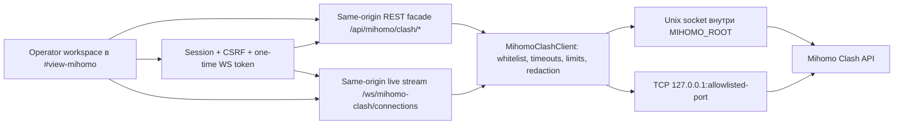

# Clash API в Xkeen UI: план реализации операторского контура Mihomo

Статус на **10 августа 2026 года**: **PR 1–3 подтверждены в реализованном объёме; PR 4–5 функционально собраны и работают на aarch64-панели, но после acceptance-аудита переведены в статус «частично закрыт / требуется доработка»**. До повторного закрытия нужно довести visual lifecycle/status security warning, provider identity/latency semantics, массовый latency budget и router mutation acceptance. WS/fallback, disconnect и connections UI по-прежнему не реализованы.
Дата последнего аудита: **10 августа 2026 года**.

Визуальный corrective gate перед следующим функциональным этапом: **реализован в исходниках 10 августа 2026 года, router acceptance ожидает поставки новой сборки**. Runtime shell уплотнён без повторных `Operator runtime`/`Mihomo`, постоянные искусственные `min-height` удалены, группы переведены на keyboard-accessible disclosure с исходно раскрытой только первой группой, добавлены массовое сворачивание/раскрытие и адаптивная 3/2/1-колоночная summary-сетка. Полный перечень причин и критериев — в разделе «Корректирующий визуальный проход Clash/Mihomo» документа [`panel-operator-redesign-completion-plan.md`](panel-operator-redesign-completion-plan.md).

### Сводка acceptance-аудита 10 августа 2026 года

Проверены рабочее дерево, targeted/full test contracts, установленная панель `ee9bf8e` и текущий Mihomo на предоставленном aarch64-роутере. Секреты, реальные IP/host, имена узлов и rule payload в документ не сохраняются.

| Область | Фактическое состояние |
| --- | --- |
| Установленная панель | `BUILD.json.version=ee9bf8e`, Python service активен; `gevent` и `geventwebsocket` установлены |
| Core/API | Mihomo `alpha-978d25a`; `/version`, `/configs`, `/proxies`, `/group`, `/providers/proxies`, `/connections` → `200` |
| REST facade | `/status`, `/proxy-groups`, `/connections` → `200`, schema v1; 15 групп, 16 providers, 387 group-node occurrences; snapshot не truncated |
| Operator workspace | Lazy workspace и groups UI реально загружаются; status показывает version/mode, filter и responsive layout работают. В исходниках выполнен corrective density/disclosure pass; установленная сборка его ещё не содержит |
| Connections | REST snapshot готов; установленный subview пока честный placeholder, WS/polling/table/disconnect отсутствуют |
| Security | Активный controller слушает LAN на `:9090` без `secret`; backend ходит к нему через loopback и `/status.security` возвращает `tcp_lan_unprotected`, но UI предупреждение ещё не отображает |
| Device enrichment | Существующий Keenetic device map на роутере возвращает 13 устройств без ошибки, но Clash connections route его не подключает; `source_name` пуст |
| Tests | Clash targeted: `77 passed, 1 skipped`; Ruff: success; frontend verify: success; groups Playwright: `1 passed`; после синхронизации inventories pytest shards дали `920 passed, 10 skipped`, `234 passed`, отдельно inventory/frontend contracts `20 passed` |

Найденный acceptance-дефект: CSS задавал `display:grid` для `#mihomo-clash-panel-config` и тем самым переопределял HTML `hidden`; одновременно оставался видимым и ready-state блок. В рабочем дереве добавлен scoped `[hidden] { display:none !important; }` contract и тест, но эта правка ещё должна войти в поставляемую сборку и пройти повторный browser acceptance.

## 1. Цель

Добавить в существующую панель Xkeen UI нативный оперативный контур для Mihomo поверх Clash REST/WebSocket API:

- видеть состояние ядра, текущий режим, трафик, память и число активных соединений;
- видеть группы политик и выбранные в них узлы;
- безопасно переключать узел и запускать ограниченный тест задержки;
- понимать, **какое устройство, куда, по какому правилу и через какую цепочку** отправляет трафик;
- завершать отдельное зависшее соединение, а все соединения — только после явного подтверждения;
- в следующей очереди просматривать правила и состояние providers без дублирования полноценного dashboard.

Интеграция относится только к **Mihomo**. Для Xray текущие экраны Routing и Logs остаются без изменений.

Термин `Clash API` используется в коде и документации как название протокола. В интерфейсе лучше использовать понятные оператору названия: **«Управление Mihomo»**, **«Соединения»**, **«Правила»**, а не выносить техническое название API в главный заголовок.

## 2. Принципы продукта

1. **Не копируем другую панель.** Берём проверенные сценарии и структуру данных, но проектируем свой интерфейс на существующих Operator Console tokens и компонентах.
2. **Router first.** Один полезный поток данных лучше четырёх постоянных WebSocket-подключений; скрытый экран не должен продолжать нагружать роутер.
3. **Ответ на операторский вопрос важнее декоративной аналитики.** Приоритет: маршрут, источник, назначение, задержка, состояние и безопасное действие.
4. **Backend владеет доступом к Mihomo.** Браузер не получает `secret`, путь Unix socket или возможность выбрать произвольный host/port.
5. **Только разрешённые операции.** Универсального `/clash/<path>` relay в Xkeen UI не будет.
6. **Progressive disclosure.** Сводка и необходимые действия видны сразу; технические metadata, provider chain и rule payload открываются в строке/инспекторе.
7. **Никаких CDN и удалённых UI-зависимостей.** Иконки — из существующего локального semantic Tabler sprite; внешние `icon` URL узлов по умолчанию не загружаются.
8. **Текущие функции не дублируем.** Редактор YAML, профили, бэкапы, проверка, сохранение, restart и обновление ядра уже принадлежат Xkeen UI.

## 3. Что было изучено

### 3.1. Текущий Xkeen UI

Репозиторий уже содержит большую часть необходимого окружения:

- вкладку `#view-mihomo` с YAML-редактором, профилями, бэкапами, validation и запуском Zashboard;
- Flask blueprint [`xkeen-ui/routes/mihomo.py`](../xkeen-ui/routes/mihomo.py) и Mihomo service-слой;
- ESM-first frontend с canonical entrypoint [`panel.entry.js`](../xkeen-ui/static/js/pages/panel.entry.js), lazy feature registry и явными feature API;
- optional gevent/WebSocket runtime с HTTP fallback на слабых MIPS/MIPSEL-роутерах;
- одноразовые scoped WebSocket tokens, session auth и глобальный CSRF guard;
- late-loaded scoped тему [`panel-operator.css`](../xkeen-ui/static/panel-operator.css), dark/light contract и responsive baselines;
- discovery имён устройств Keenetic через RCI в [`xray_device_names.py`](../xkeen-ui/services/xray_device_names.py), которую можно переиспользовать для `sourceIP` соединений Mihomo;
- шаблоны Mihomo с `external-controller: 0.0.0.0:9090` и Zashboard.

Текущий `/mihomo_panel/` — узкий GET/HEAD-маршрут для внешнего UI. Он **не является** подходящим API transport: mutating REST, потоковые данные и WebSocket через него не реализуются, а его security contract сознательно ограничен.

Новый контур должен продолжать действующие архитектурные правила из:

- [`frontend-target-architecture.md`](frontend-target-architecture.md);
- [`frontend-feature-api.md`](frontend-feature-api.md);
- [`panel-operator-stage0-contract.md`](panel-operator-stage0-contract.md);
- [`panel-operator-redesign-completion-plan.md`](panel-operator-redesign-completion-plan.md).

### 3.2. Предоставленные скриншоты

Из референсов полезны следующие сценарии:

- группы селекторов с текущим выбором, доступностью и последней задержкой;
- поиск по группам/узлам и понятный итог массового теста: успешно/таймаут;
- компактная сводка upload/download, memory и количества соединений;
- плотная таблица соединений: цепочка, host, transport, источник, трафик, возраст и локальное действие закрытия;
- отдельные режимы «Селекторы / Соединения / Конфигурация» вместо смешивания runtime и YAML в одном полотне.

Не переносим:

- сетку из десятков одинаковых карточек с флагами и emoji;
- фоновые изображения, glass-эффекты и настройку внешнего вида dashboard;
- карты, глобусы, GeoIP/ASN-запросы к внешним сервисам и тяжёлую историческую аналитику;
- универсальную настройку нескольких удалённых backend-адресов: панель управляет локальным Mihomo на этом же роутере;
- PWA, self-update внешней панели и настройки, уже имеющие эквивалент в Xkeen UI.

### 3.3. Zashboard

Проанализирован [Zephyruso/zashboard](https://github.com/Zephyruso/zashboard) на commit [`4045e5a`](https://github.com/Zephyruso/zashboard/tree/4045e5a97c659dab13758ac9107b9994afd3f920).

Полезные архитектурные наблюдения:

- request-функции отделены от сборки view state;
- `/proxies` объединяется с `/providers/proxies`, при этом provider-scoped delay endpoint решает коллизии одинаковых имён;
- соединения, логи и overview имеют независимый lifecycle;
- после смены узла возможен optional disconnect соединений, использовавших группу;
- потоковые сообщения reconnect-ятся и ограничиваются перед обновлением UI.

Zashboard распространяется по MIT, но прямой перенос компонентов не нужен. Если позднее будет заимствован конкретный фрагмент кода, copyright notice и MIT text должны попасть в third-party notices.

### 3.4. zxc-rv/XKeen-UI

Проанализирован [zxc-rv/XKeen-UI](https://github.com/zxc-rv/XKeen-UI) на commit [`aeb64f4`](https://github.com/zxc-rv/XKeen-UI/tree/aeb64f4d57c4e933ae68c1e115876d4dd9c07ea8).

Полезные решения:

- browser обращается к same-origin relay, а relay — к локальному Mihomo;
- поддерживаются TCP controller и Unix socket;
- `external-controller`, `secret` и `external-controller-unix` обнаруживаются из активного YAML;
- соединения закрываются при уходе со скрытого экрана и переподключаются с backoff;
- runtime размещён рядом с конфигурацией Mihomo, а не как отдельная чужая панель.

В корне изученного checkout не найден файл лицензии. Поэтому из этого проекта **не копируем исходный код, стили и assets**: используем только общие продуктовые наблюдения и публичный API-контракт.

### 3.5. Официальный контракт Mihomo

Источником истины остаются официальные разделы [Mihomo API](https://wiki.metacubex.one/en/api/) и [External Control](https://wiki.metacubex.one/en/config/general/#external-control-api).

Для нашего scope важны:

| Задача | Mihomo endpoint | Очередь |
| --- | --- | --- |
| Версия и probe | `GET /version` | MVP |
| Runtime config/mode | `GET /configs` | MVP, read-only |
| Группы и узлы | `GET /proxies`, `GET /group` | MVP |
| Выбор узла | `PUT /proxies/:name` | MVP |
| Задержка узла/группы | `GET /proxies/:name/delay`, `GET /group/:name/delay` | MVP |
| Provider nodes | `GET /providers/proxies` | MVP для enrichment |
| Активные соединения | `GET/WS /connections` | MVP |
| Закрытие соединения | `DELETE /connections/:id` | MVP |
| Закрытие всех | `DELETE /connections` | MVP, guarded |
| Правила | `GET /rules` | P1, read-only |
| Proxy/rule providers | `GET/PUT /providers/...` | P1 |
| Runtime logs | `GET/WS /logs` | P1, on demand |
| Traffic и memory | `GET/WS /traffic`, `GET/WS /memory` | Не нужны отдельными потоками в MVP |
| Смена mode | `PATCH /configs` | P1 после аудита |
| DNS/cache actions | `/dns/query`, `/cache/*/flush` | P2 |
| Rule disable | `PATCH /rules/disable` | P2, временное действие |
| Core/UI/GEO upgrade | `/upgrade*` | Вне scope |
| Restart через Clash API | `POST /restart` | Вне scope |
| Debug/pprof и storage | `/debug/*`, `/storage/*` | Вне scope |

`/connections` уже отдаёт `downloadTotal`, `uploadTotal`, `memory` и список соединений. Скорость можно получить как delta totals между кадрами. Поэтому для первой версии не нужны ещё два постоянных потока `/traffic` и `/memory`.

## 4. Границы первой версии

### 4.1. MVP

1. **Статус API**
   - ядро/версия;
   - controller доступен/недоступен;
   - transport: `unix` или `tcp-loopback`;
   - mode: `rule`, `global`, `direct`;
   - безопасная диагностика конфигурации без вывода secret/socket path.

2. **Управление группами**
   - группы в порядке конфигурации/GLOBAL, без алфавитного разрушения операторского порядка;
   - текущий узел, тип группы, alive, UDP и последняя задержка;
   - фильтр по группе, узлу и provider;
   - выбор узла только для поддерживающих выбор групп;
   - единичный и групповой latency test с ограничением параллелизма;
   - понятный прогресс и итог, включая timeout/cancelled.

3. **Соединения**
   - один live stream при открытом экране;
   - цепочка, host/IP:port, TCP/UDP, source device/IP, upload/download, длительность, rule/rulePayload;
   - поиск и локальные фильтры без запросов на каждое нажатие;
   - сортировка по возрасту/трафику/источнику/назначению;
   - detail inspector строки;
   - закрытие одного соединения;
   - закрытие всех только с количеством соединений и confirm.

4. **Сводка**
   - active connections;
   - upload/download rate и totals;
   - memory;
   - состояние stream: live/reconnecting/paused/fallback/error.

5. **Fallback**
   - при отсутствии gevent/WebSocket UI остаётся работоспособным через получение первого кадра HTTP stream с контролируемым интервалом;
   - отсутствие WebSocket не скрывается: интерфейс показывает `HTTP fallback`.

### 4.2. P1 после стабилизации MVP

- read-only rules с поиском по type/payload/target и переходом от соединения к совпавшему правилу;
- proxy/rule providers: freshness, node/rule count, last update, manual update и healthcheck;
- Mihomo runtime logs только при открытом экране, с уровнем, паузой и кольцевым буфером;
- ручная смена `rule/global/direct` после отдельного UX/security review;
- opt-in «после переключения закрыть соединения, проходившие через эту группу»; default — off;
- ручные настройки latency preset и page size в существующем UI settings/local state.

### 4.3. Явно вне scope

- редактирование или загрузка файлов через Clash API;
- generic reverse proxy к произвольному API path;
- удалённые controllers и список нескольких backend;
- обновление Mihomo, GEO или Zashboard через Clash API;
- restart ядра через Clash API — используется существующий XKeen service workflow с журналом;
- встроенная копия Zashboard или его iframe;
- persistent connection history на роутере;
- GeoIP/ASN enrichment и внешние запросы для каждой строки;
- rule-disable до появления понятного предупреждения о временном характере состояния;
- автоматические provider updates/healthchecks при каждом открытии страницы.

## 5. Целевая архитектура



### 5.1. Почему backend facade, а не прямой браузер → `:9090`

- secret не оказывается в URL, localStorage, DOM или browser console;
- не требуются permissive CORS и `allow-private-network`;
- панель работает при `external-controller: 127.0.0.1:9090` и через Unix socket;
- mixed content не ломает доступ при HTTPS к панели;
- browser не получает SSRF-подобную возможность менять controller host;
- одинаково работает при подключении к панели через LAN, VPN и reverse proxy;
- можно ограничить нагрузку, response size, методы и schema.

### 5.2. Target discovery

Порядок выбора transport:

1. прочитать только активный `MIHOMO_CONFIG_FILE`;
2. если задан `external-controller-unix`, разрешить путь относительно `MIHOMO_ROOT`, canonicalize и убедиться, что он не выходит за разрешённый root;
3. если socket существует — использовать Unix transport;
4. иначе извлечь **только порт** из `external-controller`, а подключаться всегда к `127.0.0.1`/`::1`, никогда к host из пользовательского YAML;
5. проверить порт по `XKEEN_CLASH_API_ALLOWED_PORTS`, default `9090`;
6. добавить `Authorization: Bearer ...` из top-level `secret`, но не возвращать его frontend;
7. выполнить `GET /version` с коротким timeout и построить capability map.

Если PyYAML доступен — использовать `safe_load`; fallback-parser должен поддерживать top-level quoted scalars и комментарии, но не пытаться быть общим YAML-парсером. Значения с неоднозначным синтаксисом должны давать диагностируемое `config_parse_failed`, а не молча использовать порт по умолчанию.

Unix API Mihomo не проверяет secret, поэтому socket разрешается только внутри доверенного Mihomo root и не принимается из request headers/query. Симлинк, уходящий за root, запрещается.

### 5.3. Backend facade

Предлагаемый публичный контракт Xkeen UI:

| Xkeen endpoint | Назначение |
| --- | --- |
| `GET /api/mihomo/clash/status` | probe, version, mode, transport kind, capabilities и safe diagnostics |
| `GET /api/mihomo/clash/proxy-groups` | нормализованные groups/nodes/providers |
| `PUT /api/mihomo/clash/proxy-groups/:group` | выбрать `{ "name": "..." }` |
| `POST /api/mihomo/clash/delay` | test по `{scope, group, proxy, preset}` без произвольного URL |
| `GET /api/mihomo/clash/connections` | первый bounded snapshot для bootstrap/HTTP fallback |
| `DELETE /api/mihomo/clash/connections/:id` | закрыть одно соединение |
| `DELETE /api/mihomo/clash/connections` | закрыть все после frontend confirm |
| `GET /api/mihomo/clash/rules` | P1 read-only rules |
| `GET /api/mihomo/clash/providers` | P1 provider state |
| `POST /api/mihomo/clash/providers/:kind/:name/update` | P1 explicit update |
| `GET /ws/mihomo-clash/connections?token=...` | live snapshots, Xkeen envelope v1 |

Фактическое уточнение schema v1: transport и diagnostics находятся в объекте `api` (`api.transport`, `api.diagnostics`), а не top-level. Реализованы первые пять REST rows до `GET /connections`; оба `DELETE`, rules/providers facade и WS endpoint — только целевой контракт следующих этапов.

Это facade, а не побайтный публичный relay. Ответы получают `schema_version: 1`; frontend нормализует optional/missing поля разных версий Mihomo. Ошибки используют существующую форму Xkeen UI: `ok=false`, безопасный `error`, машинный `code`, при необходимости `hint`.

### 5.4. Потоки и HTTP fallback

Для MVP достаточно upstream WS `/connections?interval=1000`; HTTP fallback использует отдельные bounded `GET /connections` snapshots:

- `memory` берётся из snapshot;
- rates вычисляются по разности `uploadTotal/downloadTotal` и monotonic time;
- текущие соединения берутся из того же snapshot;
- при reset totals отрицательная delta отбрасывается;
- WS upstream payload читается потоково с hard limit на один JSON frame;
- обычный HTTP `GET /connections` на проверенном Mihomo возвращает один chunked JSON snapshot и закрывает response, поэтому fallback — controlled polling, а не «первый кадр» бесконечного HTTP-stream;
- backend не хранит историю и не копит весь response body.

Frontend lifecycle:

1. открылся subview «Управление» или «Соединения» → запросить scoped one-time token;
2. открыть один WS;
3. при `document.hidden`, уходе с `#view-mihomo` или переходе в «Конфигурация» закрыть stream;
4. reconnect только пока view видим, exponential backoff + jitter, ограниченное число быстрых попыток;
5. после исчерпания попыток включить HTTP fallback;
6. fallback запрашивает один кадр не чаще одного раза в 3 секунды и прекращается на скрытом экране;
7. при возврате сначала пробует WS заново.

Отдельный `/logs` stream в P1 создаётся только при открытом log drawer и никогда не работает одновременно «на всякий случай».

### 5.5. Frontend state

Не создавать новый framework или второй global store. Feature владеет своим module-local state и экспортирует явный API:

```text
getMihomoClashApi()
activateMihomoClashSubview(name)
deactivateMihomoClashWorkspace()
refreshMihomoClashGroups()
selectMihomoClashProxy(group, name)
disconnectMihomoConnection(id)
```

State делится на:

- `capabilities/status` — редкие изменения;
- `groups/providers` — загрузка при активации, manual refresh и refresh после действия;
- `connections/overview` — live snapshot;
- `preferences` — только presentation-настройки;
- `action state` — pending/success/error по конкретной группе/строке.

Новые canonical consumers используют ESM imports. `window.XKeen.features.*` допустим только как узкий compatibility publish, если действительно нужен старому consumer.

## 6. UX в Operator Console

### 6.1. Место в навигации

Не добавлять седьмую top-level вкладку. Сохраняется существующий `#view-mihomo`, внутри него появляется компактный workspace switcher:

```text
Mihomo  [Управление] [Соединения] [Правила · P1] [Конфигурация]
```

- `Управление` — status strip + группы;
- `Соединения` — live table;
- `Правила` — P1 read-only;
- `Конфигурация` — существующий редактор, профили, бэкапы и журнал без функционального переписывания.

Это сохраняет текущие шесть top-level views и не размывает глобальную навигацию панели.

### 6.2. Status strip

Одна плоская operational row, без dashboard-карточек:

```text
API ● LIVE | Mihomo 1.x | RULE | 18 соединений | ↓ 2.4 MB/s | ↑ 180 KB/s | RAM 126 MB
```

Состояния: `loading`, `live`, `reconnecting`, `http-fallback`, `paused`, `core-stopped`, `controller-missing`, `unauthorized`, `error`.

Если API не настроен, показывается диагностический empty state с готовым безопасным примером, кнопками «Открыть конфигурацию» и «Проверить снова». Автоматически менять YAML нельзя.

### 6.3. Управление группами

Вместо большой мозаики карточек:

- одна строка заголовка группы: name, type, current node, alive count, action refresh/test;
- внутри — компактные node rows;
- колонки: selection, node, provider/protocol, alive, delay, capabilities;
- current node выделяется accent border/marker, не заливкой всей карточки;
- latency tone: success/warning/danger/muted; timeout — текст `таймаут`, а не магическое число;
- `DIRECT`, `REJECT` и группы визуально отличаются текстовым type/status, не emoji;
- длинные имена ellipsis + copy/detail, без разрастания сетки;
- массовый тест показывает bounded progress и даёт отменить очередь.

Особые случаи:

- `LoadBalance` без выбора — action disabled с объяснением;
- `URLTest`/`Fallback` с `fixed` — явно показать auto/fixed;
- hidden groups по умолчанию не показывать, но дать переключатель;
- одноимённые provider nodes адресовать через provider-scoped endpoint;
- после успешного выбора обновить только затронутую группу, затем тихо сверить `/proxies`.

### 6.4. Соединения

Desktop — dense operational table:

| Цепочка | Назначение | Тип | Источник | Трафик | Возраст | Действие |
| --- | --- | --- | --- | --- | --- | --- |

Показываем:

- `chains` в фактическом порядке;
- `host || sniffHost || destinationIP` и destination port;
- `network/type` (`TCP`, `UDP` и inbound type, если полезно);
- имя Keenetic-устройства из существующего device map, затем source IP:port;
- upload/download и duration;
- matched `rule` + `rulePayload` в detail inspector;
- process/inbound/providerChains только в details, чтобы не перегружать строку.

Mobile ≤820 px — record cards с теми же данными, без горизонтального скролла основной страницы. Desktop table может иметь горизонтальный scroll только внутри собственного canvas.

Фильтры:

- общий search;
- active/closed не вводим, потому что MVP не хранит историю;
- TCP/UDP;
- source device;
- цепочка/group;
- DIRECT/proxy/reject по фактическим данным.

Кнопка «Закрыть все» отделена как danger action, показывает число активных соединений и требует confirm. Закрытие одной строки не требует второго модала, но имеет pending state и понятную ошибку.

### 6.5. Правила и providers (P1)

Правила — read-only record list:

- index, type, payload, target;
- hit count/last hit только если поля есть в конкретной версии Mihomo;
- поиск и фильтр target/type;
- ссылка из connection details подсвечивает совпавшую rule;
- temporary disable не входит в P1.

Providers — компактные rows:

- name/type, updatedAt, count, vehicle, status;
- manual update и healthcheck;
- никаких автозапусков при старте панели;
- после action — один refresh соответствующего provider и proxy groups.

## 7. Security contract

### 7.1. Обязательные ограничения

- controller target определяется только backend из активного config/env, не из request;
- TCP host всегда loopback, port — allowlist;
- Unix path canonicalized и остаётся внутри разрешённого root;
- Mihomo secret никогда не возвращается frontend, не пишется в log и не передаётся в WS query;
- browser WS использует новый one-time scope `mihomo-clash`, session auth и same-origin `Origin` check;
- mutating REST защищён существующим CSRF guard;
- upstream методы и paths заданы статической таблицей;
- имена group/proxy/provider кодируются как один path segment;
- delay test принимает preset id, а не произвольный URL;
- connect/read/total timeouts, max response/frame bytes и concurrency limits обязательны;
- upstream error body не отдаётся пользователю без sanitization;
- никакие panel cookies, CSRF headers, Host/Origin/Referer не проксируются в Mihomo;
- connection IDs проверяются по длине/формату и кодируются;
- destructive actions имеют отдельный audit/restart log event без sensitive data;
- `/debug`, `/storage`, `/upgrade`, config path/payload и неизвестные endpoints недоступны.

### 7.2. Конфигурационная диагностика

`GET /status` возвращает только флаги/коды:

- `controller_missing`;
- `controller_unreachable`;
- `secret_missing_on_lan_bind`;
- `port_not_allowed`;
- `unix_socket_missing`;
- `unix_socket_outside_root`;
- `version_unsupported_or_unknown`;
- `ws_runtime_unavailable`.

Фактический ответ также содержит безопасный объект `security` (`mode`, `recommended_transport`, `migration_required`, `panel_password_reuse`). На текущей панели это backend-only signal: frontend warning ещё должен быть добавлен в Этап 3.

Текущие bundled templates слушают `0.0.0.0:9090` и не задают непустой secret. Интеграция сначала должна уметь работать с ними, но одновременно показать предупреждение. На этапе rollout шаблоны переводятся на более безопасный default: loopback controller с сгенерированным secret и/или Unix socket. Миграция существующего пользовательского YAML — только opt-in preview/diff, никогда silent rewrite.

### 7.3. Rate/resource limits

Начальные ограничения, уточняемые после Stage 0 measurements:

- один connection stream на активную browser tab;
- один latency batch одновременно на session;
- параллелизм node delay tests: максимум 3 на слабых устройствах, 5 только после замера;
- timeout одного delay test: bounded 1–10 s;
- не более 250 connection rows в одной DOM page; остальные доступны page/filter без потери snapshot counters;
- logs ring buffer P1: максимум 500 строк в browser memory;
- groups/providers refresh не чаще 10 s автоматически; обычный режим — on activate/on action/manual;
- frame и response hard limits с отдельным `upstream_payload_too_large`;
- hidden page создаёт ноль polling/stream traffic.

## 8. Предлагаемая файловая карта

### Backend

```text
xkeen-ui/services/mihomo_clash_target.py   # config discovery, redacted diagnostics
xkeen-ui/services/mihomo_clash_client.py   # TCP/Unix HTTP client + endpoint whitelist
xkeen-ui/services/mihomo_clash_stream.py   # bounded JSON/NDJSON frames, HTTP snapshot fallback
xkeen-ui/routes/mihomo_clash.py            # Xkeen REST facade
xkeen-ui/routes/__init__.py                # blueprint registration
xkeen-ui/services/ws_tokens.py             # scope mihomo-clash
xkeen-ui/run_server.py                     # dedicated WS dispatch
```

Не раздувать существующий [`routes/mihomo.py`](../xkeen-ui/routes/mihomo.py): он уже велик и отвечает за config/import/profile flows, а runtime API имеет отдельные security и lifecycle обязанности.

### Frontend

```text
xkeen-ui/static/js/features/mihomo_clash/client.js
xkeen-ui/static/js/features/mihomo_clash/state.js
xkeen-ui/static/js/features/mihomo_clash/overview.js
xkeen-ui/static/js/features/mihomo_clash/groups.js
xkeen-ui/static/js/features/mihomo_clash/connections.js
xkeen-ui/static/js/features/mihomo_clash/rules.js       # P1
xkeen-ui/static/js/features/mihomo_clash/index.js       # canonical feature API
xkeen-ui/static/js/features/index.js
xkeen-ui/static/js/pages/panel.lazy_bindings.runtime.js
xkeen-ui/static/js/pages/panel.view_runtime.js
xkeen-ui/templates/panel.html
xkeen-ui/static/panel-operator.css
```

Модуль грузится lazy только при первом входе в `#view-mihomo`. Существующий `mihomo_panel.js` продолжает владеть редактором; новый feature владеет только runtime workspace.

### Tests/fixtures/docs

```text
tests/fixtures/mihomo_clash/*.json
tests/test_mihomo_clash_target.py
tests/test_mihomo_clash_client.py
tests/test_mihomo_clash_routes.py
tests/test_mihomo_clash_stream.py
tests/test_mihomo_clash_frontend_contract.py
e2e/mihomo_clash_workspace.spec.mjs
docs/README_clash_api_implementation_plan.md
```

## 9. Поэтапный план работ

### Этап 0. Зафиксировать контракт и реальные данные

Статус после аудита 10 августа 2026 года: **локальный contract baseline PR 1 подтверждён; полный Этап 0 остаётся открытым** из-за Unix/mipsle/WS/no-gevent и нагрузочных acceptance-пунктов.

Задачи:

- [x] Добавить redacted contract fixtures для `/version`, `/configs`, `/proxies`, `/group`, `/providers/proxies`, трёх кадров `/connections` и типовых errors.
- [x] Снять безопасную schema-сводку с реального aarch64-роутера: фактическая версия Mihomo, optional fields, TCP transport, размеры и HTTP semantics. Raw payload с адресами/узлами не сохранять в репозитории.
- [x] Зафиксировать product DTO v1 и capability-safe поля; UI не должен читать raw JSON.
- [x] Добавить реализационный wireframe четырёх subviews и state matrix для desktop/mobile, dark/light через Operator shell/CSS/contract tests.
- [x] Зафиксировать локальные budgets: максимум 256 групп, 1024 узлов в группе, 250 connection rows и bounded payload fields. Точные frame/DOM/concurrency budgets уточняются после измерений на роутере.
- [ ] Проверить Unix socket и mipsle после появления client/stream transport (Этапы 1–2); TCP и HTTP snapshot semantics на aarch64 проверены.
- [ ] Снять и утвердить точные CPU/RAM/network/frame/DOM budgets на 100/500 connections и реальном массовом latency batch; текущие числа 256/1024/250 — только защитные caps.

Что закрыто в первом рекомендуемом шаге:

- `tests/fixtures/mihomo_clash/` содержит безопасный redacted contract-набор без реальных секретов и адресов;
- `xkeen-ui/services/mihomo_clash_target.py` выполняет loopback-only/allow-listed target discovery и не раскрывает secret/socket path;
- `xkeen-ui/services/mihomo_clash_dto.py` нормализует status, groups/providers и bounded connections в schema version 1;
- `tests/test_mihomo_clash_contract.py` проверяет порядок групп, provider enrichment/коллизии имён, capability allowlist, source-device mapping, truncation и redaction;
- `tests/test_mihomo_clash_target.py` проверяет quoted/fallback YAML, IPv6 loopback, fail-closed port allowlist, traversal и безопасные diagnostics.

Локальная проверка при закрытии шага:

- `python -m pytest tests/test_mihomo_clash_contract.py tests/test_mihomo_clash_target.py -q` → `21 passed`;
- `python -m ruff check xkeen-ui/services/mihomo_clash_target.py xkeen-ui/services/mihomo_clash_dto.py tests/test_mihomo_clash_contract.py tests/test_mihomo_clash_target.py` → `All checks passed`;
- real-router probe: Keenetic Linux 4.9, aarch64; сборка панели `1642dad`; Mihomo `alpha-978d25a`, linux arm64, Go 1.26.5;
- controller discovery: TCP target ready, все read-only endpoints `/version`, `/configs`, `/proxies`, `/group`, `/providers/proxies`, `/connections` ответили `200`;
- повторный probe 10 августа подтвердил 46 proxy entries, 16 group entries и 16 providers; текущий connection count меняется во времени и не является фиксированным baseline;
- размеры/время одного запроса: `/version` 40 B / 15.1 ms, `/configs` 1,492 B / 4.6 ms, `/proxies` 32,821 B / 16.8 ms, `/group` 23,112 B / 10.9 ms, `/providers/proxies` 158,912 B / 65.0 ms;
- пять `GET /connections` с интервалом 1 s: по 5,980 B, 7 rows, 3.4–5.2 ms; response — `application/json`, chunked, соединение закрывается после одного snapshot;
- mutation endpoints не вызывались; реальные имена, IP, host, rule payload и secret в документацию не записаны;
- security finding повторно подтверждён: controller слушает `:::9090`, `secret` не задан, `/version` доступен из LAN. Backend facade принудительно использует loopback, но сам controller остаётся LAN-доступным до явной миграции на loopback/Unix или non-empty secret.

Критерий выхода полного Этапа 0:

- локальные fixtures и DTO review завершены;
- нет предположений о raw schema, не подтверждённых официальной документацией или fixture;
- aarch64 TCP schema/semantics baseline закрыт; Unix, mipsle, WS/no-gevent и нагрузочные 100/500 connections остаются открытыми до реализации transport.

### Этап 1. Безопасный target discovery и client

Статус после аудита 10 августа 2026 года: **реализация Этапа 1 закрыта на уровне кода и fake transport; router matrix закрыта частично**. Loopback TCP подтверждён на aarch64, Unix client покрыт unit/fake server и ранее временным aarch64 probe; постоянная Unix-конфигурация, symlink acceptance на Linux и mipsle остаются в Этапе 8.

Задачи:

- [x] Реализовать parser `external-controller`, `external-controller-unix`, `secret`.
- [x] Реализовать безопасное разрешение Unix path и TCP port allowlist.
- [x] Реализовать HTTP transport для loopback TCP и Unix domain socket без новой тяжёлой runtime-зависимости.
- [x] Ввести статическую таблицу method/path/content-type/timeouts.
- [x] Реализовать bearer auth, redaction и безопасную классификацию errors.
- [x] Добавить response/frame size limits и bounded streaming parser.
- [x] Unit tests: quotes/comments/IPv6, traversal, bad port, missing socket, secret redaction, partial frames, oversized payload/frame и error mapping. Symlink acceptance остаётся Linux router checklist.

Критерий выхода:

- backend client имеет allowlisted operations для version/config/proxies/groups/providers/connections и реальный status facade получает version/config по TCP; Unix transport проверен fake HTTP server на aarch64;
- произвольный host/path/method нельзя передать через HTTP request Xkeen UI;
- secret отсутствует в response, exception, access/debug log и snapshot tests.

### Этап 2. REST facade, auth и capabilities

Статус после аудита 10 августа 2026 года: **REST-часть PR 3 подтверждена закрытой**: versioned status/groups/select/delay/connections snapshot работают локально и на aarch64. WS scope/stream, disconnect и device enrichment не входят в закрытый объём и остаются Этапом 5.

Задачи:

- [x] Создать отдельный `mihomo_clash` blueprint и зарегистрировать его в canonical registry.
- [x] Реализовать read-only `/status` со schema v1, telemetry, capability map и states `ready/controller_missing/not_configured/blocked/unauthorized/core_stopped/error`.
- [x] Реализовать `/proxy-groups`, select, preset-only delay и bounded connection snapshot. Disconnect остаётся вместе с live connections backend (Этап 5).
- [ ] Добавить scope `mihomo-clash` в one-time WS tokens.
- [ ] Добавить same-origin check для WS и сохранить session defense-in-depth.
- [x] Добавить in-process per-action concurrency/rate guard для select/delay; stream/disconnect получат отдельные лимиты при реализации.
- [ ] Подключить существующий device map для enrichment source IP без запроса RCI на каждый frame.
- [x] Добавить TCP/Unix fake Mihomo tests для happy/error/oversized/invalid content cases; timeout/reconnect расширить вместе с live stream.
- [x] Добавить status capability/state так, чтобы клиент мог отличать controller missing, blocked config, core stopped и unauthorized; WS unavailable появится вместе с WS backend. Отдельное визуальное отображение security posture в UI остаётся недоделкой Этапа 3.

Что закрыто в рекомендуемом PR 3:

- `GET /api/mihomo/clash/proxy-groups` объединяет `/proxies` и `/providers/proxies` через DTO v1, сохраняет операторский порядок и не отдаёт raw upstream JSON;
- `PUT /api/mihomo/clash/proxy-groups/<group>` кодирует имя группы как один path segment, принимает только bounded JSON `{name}`, сверяет группу/узел со свежим snapshot до mutation, а после неё снова читает `/proxies` и возвращает `reconciled`;
- `POST /api/mihomo/clash/delay` принимает только `scope/name/preset` и optional `provider` для `provider-proxy`; URL, timeout и expected status заданы backend allowlist (`google`/`cloudflare`), произвольный URL из browser не используется;
- `GET /api/mihomo/clash/connections` возвращает bounded DTO v1 и служит bootstrap/HTTP fallback snapshot без открытия постоянного stream;
- mutating endpoints используют существующие session + global CSRF guards; in-process guard ограничивает select/delay по authenticated subject и глобальному concurrency/rate budget; select/delay пишут sanitized audit event без имени узла, secret, URL и controller target;
- dynamic endpoint templates валидируются, имена ограничиваются и percent-encode-ятся как ровно один path segment; safe error mapping не раскрывает upstream body или exception message.

Проверка закрытия рекомендуемого PR 3:

- targeted Clash + security suite: `72 passed, 1 skipped` (Unix socket unit test пропущен только на Windows);
- Ruff для изменённых backend/test файлов: `All checks passed`;
- `git diff --check` проходит;
- реальные mutation endpoints роутера не вызывались: select/delay проверены через fake Mihomo, чтобы не менять активный трафик пользователя.

Решение по transport/security:

- рекомендуемый режим без `secret` — `external-controller-unix` внутри `/opt/etc/mihomo`;
- совместимый fallback — TCP controller, к которому backend всегда подключается только через loopback;
- пароль панели не переиспользуется: панель хранит только password hash, а копирование login password в Mihomo создало бы связанную ротацию двух независимых security domains;
- текущий LAN bind без `secret` не меняется молча: `/status.security` возвращает `tcp_lan_unprotected`, `recommended_transport=unix`, `migration_required=true`; миграция YAML будет отдельным явным workflow с backup/validate/restart.

Проверка закрытия шага:

- targeted backend suite: `45 passed, 1 skipped` (Unix socket unit test пропущен только на Windows);
- registry/import smoke вместе с targeted suite: `48 passed, 5 skipped`;
- aarch64 acceptance во временном `/tmp`: real TCP `/status` → `200`, `state=ready`, schema v1, mode `rule`; fake Unix HTTP → `200`, payload parsed; временные файлы удалены;
- реальная конфигурация, selector state и connections на роутере не изменялись.

Критерий выхода:

- все mutating calls требуют login + CSRF;
- REST schemas стабильны и versioned;
- core/offline/error состояния различимы, internal exception пользователю не раскрывается.

### Этап 3. Operator shell и lifecycle

Статус после аудита 10 августа 2026 года: **частично закрыт, повторно открыт для acceptance-доработок**. Switcher, wrapper, lazy ESM, status states и AbortController lifecycle реализованы, но установленная сборка показала visual lifecycle defect: `hidden` переопределялся Operator CSS. Локальная CSS/test правка подготовлена; до повторного закрытия нужны новая сборка и browser acceptance. Security posture из `/status.security` также ещё не показан оператору.

Задачи:

- [x] Добавить internal switcher в `#view-mihomo`, не меняя top-level navigation.
- [x] Переместить существующий editor/vault/log визуально в subview «Конфигурация» без смены IDs/handlers.
- [x] Создать canonical ESM feature API и lazy registration.
- [x] Реализовать abort/deactivate/visibility lifecycle в JS.
- [ ] Подтвердить после исправления CSS, что только активный subview визуально присутствует и hidden/config/inactive состояния дают ноль Clash traffic; установленная `ee9bf8e` эту visual часть не проходит.
- [x] Реализовать status strip и состояния idle/loading/ready/controller-missing/not-configured/blocked/core-stopped/unauthorized/paused/error. `http-fallback/reconnecting` добавятся вместе с live stream.
- [ ] Показывать `security.mode=tcp_lan_unprotected` / `migration_required=true` как заметное warning-состояние с переходом в конфигурацию; сейчас установленная панель показывает только `API · готов`.
- [x] Добавить semantic icons через существующий operator sprite; raw emoji отсутствуют.
- [x] Обновить icon inventory и frontend page inventory; legacy Mihomo IDs сохранены.
- [ ] Довести Stage 0 DOM inventory/generator contract до полного green вместе со всем suite и не считать tab controls accordion-ами.

Критерий выхода:

- существующие save/restart/validate/profile flows проходят без изменений;
- новый feature не грузится до входа в Mihomo;
- при уходе в «Конфигурация» и со вкладки Mihomo сетевой runtime останавливается;
- dark/light и keyboard focus соответствуют Operator contract.

Что закрыто в рекомендуемом PR 4:

- внутри существующего `#view-mihomo` добавлен switcher `Управление / Соединения / Правила · P1 / Конфигурация`; top-level navigation не расширялась;
- editor, vault и журнал обёрнуты в `#mihomo-clash-panel-config`, при этом все прежние IDs и handlers сохранены;
- `features/mihomo_clash/{client,state,index}.js` экспортирует canonical API `get/activate/deactivate/activateSubview/refreshStatus` и загружается только при первом входе в Mihomo;
- status strip читает только versioned `/api/mihomo/clash/status`, различает operational states и даёт явные `Проверить снова`/`Открыть конфигурацию`; YAML не меняется автоматически;
- уход с top-level Mihomo, переход в `Конфигурация` и `document.hidden` abort-ят активный request; возврат выполняет один свежий probe;
- desktop/mobile, dark/light используют текущие Operator tokens, semantic sprite, keyboard tablist и reduced-motion contract; `Правила` остаются видимым disabled P1 пунктом без ложной функциональности;
- icon inventory регенерирован осознанно после добавления статических controls; contract test проверяет сохранность legacy Mihomo DOM IDs.

Что обнаружено acceptance-аудитом и переоткрыто:

- на установленной панели одновременно рендерились `Управление` и скрытая `Конфигурация`, а ready-state summary оставался видимым над groups content: у `.xk-mihomo-config-subview { display:grid }` и `.xk-mihomo-runtime-state { display:grid }` была выше cascade-эффективность, чем у HTML `hidden`;
- в рабочем дереве добавлен scoped contract для `.xk-mihomo-runtime-state[hidden]`, `.xk-mihomo-runtime-panel[hidden]` и `.xk-mihomo-config-subview[hidden]`, а frontend contract test теперь требует эти selectors;
- текущий state strip не использует безопасный `/status.security`, поэтому критичный LAN controller warning остаётся только в JSON, а не в UI;
- rules tab ссылается на отсутствующий `mihomo-clash-panel-rules`; disabled-control безопасен, но до Этапа 6 нужен либо реальный placeholder panel, либо удаление `aria-controls` до реализации.

Проверка закрытия рекомендуемого PR 4:

- frontend targeted suite: `141 passed`;
- `npm run frontend:verify` успешно, Vite собирает отдельный lazy chunk `mihomo_clash`;
- `node --check` проходит для новых ESM и изменённых runtime modules;
- packaging smoke `build_user_archive.py --skip-frontend-build` успешно создаёт архив;
- backend router/config/traffic в этом шаге не изменялись.

Повторная проверка 10 августа:

- реальная панель на aarch64 lazy-загружает workspace, показывает Mihomo version/mode и рабочие группы;
- responsive probe `390×844`: горизонтального overflow у document нет;
- targeted inventory/frontend suite после локальной правки: `20 passed`;
- полная browser acceptance исправленной сборки пока не выполнена, поэтому Этап 3 не возвращён в `закрыт`.

### Этап 4. Группы, выбор и latency

Статус после аудита 10 августа 2026 года: **частично закрыт, повторно открыт для real-router semantics/performance acceptance**. Compact groups UI, filter/manual refresh, confirmed select, single/group/visible latency queue и cancel реализованы и работают в browser. Не закрыты точная provider identity на реальной схеме, реальный select/delay acceptance и безопасный бюджет массового теста.

Задачи:

- [x] Нормализовать `/proxies` + providers, сохранив порядок групп.
- [x] Реализовать compact group/node rows, filters и manual refresh.
- [x] Показывать type/alive/current/history и unknown states.
- [ ] Исправить provider semantics: реальный `/providers/proxies` содержит 16 логических group providers с множественным повторением имён; UI сейчас показывает `16 providers` для одного узла, что не является однозначной provider-привязкой и вводит оператора в заблуждение.
- [x] Реализовать select с per-row pending, rollback UI при error и тихой сверкой state.
- [x] Реализовать single/group/visible latency queue с preset URL, cancel и bounded concurrency.
- [x] Поддержать provider-scoped healthcheck для действительно однозначной provider-привязки и разделять ключи batch state по `provider + node`.
- [ ] Добавить real-router fixture/acceptance для provider collision semantics; при неоднозначности не выдавать число memberships за provider узла и не выбирать произвольный provider-scoped endpoint.
- [x] Не закрывать соединения после переключения автоматически; P1 opt-in остаётся отдельным будущим UX/action.

Критерий выхода:

- выбор отражает подтверждённое ядром состояние, а не optimistic state навсегда;
- timeout/failed/cancelled различаются;
- 100+ nodes не запускают 100 одновременных запросов: browser queue формально ограничена тремя workers, но backend guard сериализует одну session. Реальный экран содержит 387 group-node occurrences; `Тест видимых` может создать до 27 уникальных sequential probes, а при `action_busy` workers делают до 20 retry. До повторного закрытия нужен router measurement и меньший явный batch cap/cadence без retry storm;
- `Selector` получает action; для automatic `URLTest`/`Fallback`/`Smart` нужно отдельно проверить fixed-selection UX и реализовать clear-fixed через allow-listed `DELETE /proxies/:name`, прежде чем считать их полноценно управляемыми.

Что закрыто в рекомендуемом PR 5:

- `features/mihomo_clash/groups.js` реализует compact operator rows без dashboard-мозаики, локальный поиск по group/node/provider, переключатель hidden groups и manual refresh;
- выбор узла не меняет `now` оптимистично: row получает pending, затем используется только подтверждённая backend reconciliation; при stale conflict выполняется свежий refresh;
- single node, group и «тест видимых» используют только backend preset, различают `done/timeout/failed/cancelled`, имеют cancel и не более трёх browser workers;
- для узла с однозначным provider используется allow-listed `/providers/proxies/<provider>/proxies/<node>/healthcheck`; оба dynamic segment кодируются отдельно, raw URL от browser не принимается;
- lifecycle останавливает groups fetch и latency queue при уходе из `Управления`, top-level Mihomo или при скрытии документа через общий workspace contract;
- desktop использует плотные group/node rows, mobile — двухколоночные records без горизонтального scroll; current node отмечен accent marker, состояния — текстом и semantic tone, без emoji.

Что обнаружено acceptance-аудитом и переоткрыто:

- installed groups DTO стабильно возвращает 15 групп, 16 provider summaries и 387 group-node occurrences; DOM создаёт 387 строк сразу. Это ниже DTO caps, но ещё не подтверждает заявленную производительность на слабом mipsle;
- реальная provider schema — это provider membership по именам групп, а не всегда источник узла; у 27 имён найдено несколько memberships, максимум 16. Текущая подпись `N providers` полезна как diagnostic count, но ошибочно выглядит как provider identity;
- DTO/UI разрешают PUT для `URLTest`/`Fallback`/`Smart`, хотя их fixed-selection lifecycle не завершён: нет `fixed` indicator и clear action;
- real router mutation endpoints (select/delay) намеренно не вызывались, поэтому подтверждены transport/fake reconciliation и browser wiring, но не end-to-end semantics текущего core;
- E2E проверяет один Selector, filter/hidden и один provider delay; group delay, visible batch/cancel, timeout/failed, stale reconciliation, keyboard path и mobile screenshots ещё не покрыты browser test.

Проверка закрытия рекомендуемого PR 5:

- targeted Clash suite: `77 passed, 1 skipped` (Unix socket test пропущен только на Windows);
- Ruff для затронутых backend/test файлов: `All checks passed`;
- `npm run frontend:verify` успешно; lazy chunk `mihomo_clash` собран отдельно (`19.91 kB`, gzip `7.19 kB`);
- `node --check` для `client.js`, `groups.js`, `state.js`, `index.js` и `git diff --check` проходят;
- Playwright `e2e/mihomo_clash_groups.spec.mjs` → `1 passed`: filter/hidden/select/provider-scoped delay проверены в реальном browser DOM;
- packaging smoke с `build_user_archive.py --skip-frontend-build` успешно создаёт локальный архив;
- mutation/latency endpoints реального роутера в этом шаге не вызывались: проверки transport/routes выполнены через fake Mihomo, активный маршрут пользователя не менялся.

Повторная проверка 10 августа:

- targeted Clash suite: `77 passed, 1 skipped`; Ruff: `All checks passed`;
- `npm run frontend:verify` и `e2e/mihomo_clash_groups.spec.mjs` проходят (`1 passed`);
- установленная панель реально загружает 15/387, search/hidden controls и status; никакие selector/latency mutations в acceptance-аудите не выполнялись.

### Этап 5. Live connections и overview

Статус на 10 августа 2026 года: **не начат, кроме подготовительного REST snapshot и bounded DTO/parser**. Установленный subview показывает placeholder; capability `connections_snapshot=true`, `connections_stream=null`, `connection_disconnect=null`.

Задачи:

- [ ] Реализовать dedicated WS dispatch в `run_server.py` и bounded HTTP snapshot polling fallback.
- [ ] Добавить Xkeen envelope v1: sequence, received time, state, bounded payload.
- [ ] Реализовать reconnect/backoff/jitter, visibility pause и fallback transition.
- [ ] Рассчитывать rates из totals, обрабатывать reset и пропуски кадров.
- [ ] Реализовать keyed rows/page, локальный search/filter/sort и details inspector.
- [ ] Enrich source IP через кешированный Keenetic device map.
- [ ] Реализовать disconnect one/all и подтверждение для all.
- [ ] Добавить mobile record layout и accessible live-state announcements без озвучивания каждого кадра.

Acceptance baseline: на aarch64 существующий `get_xray_device_names_state()` вернул 13 устройств без `router_error`, но Clash route вызывает DTO без `device_map`, поэтому в текущем snapshot `source_name` не заполнен. Это подтверждает, что enrichment можно сделать без нового discovery-механизма, но его нельзя считать готовым.

Критерий выхода:

- на экране есть ответ «устройство → host → правило → цепочка»;
- один stream не размножается при повторных входах;
- disconnect failure не удаляет строку навсегда до подтверждения snapshot;
- hidden page даёт нулевой traffic от feature;
- HTTP fallback остаётся функциональным на runtime без WebSocket.

### Этап 6. Rules, providers и logs (P1)

Задачи:

- [ ] Добавить read-only rules и cross-link из connection details.
- [ ] Добавить provider status/update/healthcheck с ручным запуском.
- [ ] Добавить on-demand structured logs с pause/filter/ring buffer.
- [ ] После UX review добавить mode switch и optional disconnect-after-select.
- [ ] Отдельно решить, нужен ли temporary rule disable; не включать его скрыто вместе с viewer.

Критерий выхода:

- P1 streams живут только пока соответствующий subview/drawer открыт;
- временные runtime actions явно отделены от persistent YAML;
- нет дублирования существующих config/restart/update функций.

### Этап 7. Безопасные шаблоны и rollout

Задачи:

- [ ] Обновить bundled templates: loopback/Unix-first controller и non-empty generated secret там, где нужен TCP.
- [ ] Добавить validator warning для LAN bind без secret.
- [ ] Предложить opt-in diff/patch для существующего config, с backup + validate + explicit restart.
- [ ] Сохранить Zashboard как optional external tool, но убрать его из основного runtime workflow.
- [ ] Обновить root README, install notes, Android behavior и security guidance.
- [ ] Добавить release note и feature flag для первого rollout при необходимости.

Критерий выхода:

- новая установка не требует публичного unauthenticated controller;
- старая конфигурация продолжает работать или получает понятную инструкцию без silent mutation;
- rollback состоит в отключении feature/возврате YAML, а не в переустановке панели.

### Этап 8. Финальная проверка и закрытие инициативы

Задачи:

- [ ] Unit/integration/contract/E2E проходят на Windows dev и Linux CI.
- [ ] Router acceptance: aarch64 + mipsle, gevent + no-gevent.
- [ ] Dark/light: 1920×1080, 1440×900, 1024×768, 390×844, 360×800.
- [ ] Keyboard, focus, screen-reader labels, reduced motion и touch targets проверены.
- [ ] Измерены CPU/RAM/network при idle, 100 и 500 connections, latency batch.
- [ ] Выполнены `npm run frontend:verify`, `pytest` и целевые Playwright suites.
- [ ] Обновлены frontend/operator inventories и документация только после осознанного diff.
- [ ] Проведён security review endpoint whitelist, target resolution, tokens, CSRF, redaction и limits.

Критерий выхода:

- все MVP acceptance scenarios закрыты тестом или router checklist;
- нет постоянной нагрузки на скрытом экране;
- нет утечки Mihomo secret;
- Zashboard не требуется для основных runtime-сценариев;
- этот файл переведён из активного plan в итоговый contract/status document.

## 10. Тестовая стратегия

### Backend unit

- target discovery для quoted/unquoted YAML, IPv4/IPv6 и Unix;
- socket root/symlink/path traversal;
- port allowlist и loopback-only target;
- endpoint/method whitelist и path-segment encoding;
- Authorization injection и redaction;
- timeouts, broken pipe, truncated/invalid JSON, oversized body/frame;
- optional fields и неизвестные proxy/group types;
- first-frame stream cancellation без зависшего worker/socket.

### Integration с fake Mihomo

- TCP server с fixture responses и streaming NDJSON;
- Unix server на Linux CI;
- 401, 404 capability gap, 429/5xx, disconnect mid-frame;
- slow producer/consumer;
- reconnect после restart ядра;
- select → refresh → подтверждённый `now`;
- disconnect → следующий snapshot без ID.

### Frontend contract/E2E

- lazy load и view lifecycle;
- CSRF on mutations и one-time WS token;
- все status/error/empty/fallback states;
- group filtering/select/delay progress;
- connections search/filter/sort/details/disconnect;
- отсутствие duplicate listeners/streams после десяти переключений subview;
- current Mihomo editor/profile/backups regression suite;
- dark/light/mobile screenshots и keyboard path.

### Router acceptance

Минимальные сценарии:

1. controller TCP + secret;
2. controller Unix;
3. controller отсутствует;
4. Mihomo остановлен/перезапущен при открытом UI;
5. gevent доступен;
6. gevent недоступен — HTTP fallback;
7. 100+ активных соединений;
8. смена selector при активном трафике;
9. потеря LAN/VPN и восстановление;
10. конфигурация с одинаковыми именами nodes в разных providers.

## 11. Definition of Done для MVP

- [ ] Runtime находится внутри текущей вкладки Mihomo и визуально соответствует Operator Console.
- [ ] Видны version/mode/live state/connections/rates/totals/memory.
- [ ] Группы загружаются, фильтруются, выбираются и тестируются с bounded concurrency.
- [ ] Соединения показывают source device, destination, chain, traffic, age и rule details.
- [ ] Можно безопасно закрыть одно или все соединения.
- [ ] TCP loopback и Unix socket покрыты тестами; direct browser controller не требуется.
- [ ] Secret отсутствует во frontend и logs.
- [ ] HTTP fallback работает без gevent.
- [ ] При скрытом экране нет stream/polling.
- [ ] Existing Mihomo config/editor/profile/backups/Zashboard action не сломаны.
- [ ] Dark/light, desktop/mobile, keyboard и failure states покрыты Playwright.
- [ ] Реальные aarch64/mipsle замеры укладываются в бюджеты, утверждённые на Этапе 0.

## 12. Рекомендуемый порядок pull requests

Чтобы review и rollback оставались управляемыми:

1. **PR 1 — fixtures, DTO, target discovery, security tests** — подтверждён кодом/тестами и aarch64 TCP baseline;
2. **PR 2 — TCP/Unix client, stream parser, status facade** — подтверждён кодом/тестами; полная router matrix остаётся Этапом 8;
3. **PR 3 — REST groups/select/delay + fake Mihomo integration** — подтверждён локально и read-only aarch64 acceptance 10 августа 2026 года;
4. **PR 4 — internal Operator workspace shell и status states** — частично закрыт: требуется повторная поставка visual lifecycle fix и security warning;
5. **PR 5 — groups UI** — частично закрыт: требуется provider/fixed-selection semantics и real-router latency/select acceptance;
6. **PR 6 — connections WS/fallback backend**;
7. **PR 7 — connections/overview UI + device enrichment**;
8. **PR 8 — performance, responsive, accessibility, router acceptance**;
9. **PR 9 — P1 rules/providers/logs**;
10. **PR 10 — safe templates, migration UX и финальная документация**.

Не объединять generic relay, UI, template migration и destructive actions в один большой PR.

## 13. Основные риски

| Риск | Мера |
| --- | --- |
| Утечка `secret` | backend-only credential, redaction tests, запрет request override |
| SSRF к сервисам роутера | loopback + allowlisted port + endpoint table, без generic relay |
| Unix socket указывает вне Mihomo root | canonicalize, root allowlist, symlink test |
| Нагрузка от нескольких streams | один `/connections` stream, view lifecycle, HTTP fallback cadence |
| Большой DOM при сотнях connections | keyed update, page cap, local filter, без history |
| API drift между версиями Mihomo | DTO v1, capability probe, optional fields, fixtures нескольких версий |
| Optimistic UI расходится с ядром | обязательный refresh/reconciliation после action |
| Switch обрывает пользовательский трафик | auto-disconnect default off; explicit opt-in только P1 |
| Старые templates открывают API в LAN без secret | warning сейчас, safe template и opt-in migration на rollout |
| Регрессия существующего редактора | subview wrapper без смены IDs/handlers + текущие contract/E2E tests |
| Код из референса без ясной лицензии | independent implementation; код zxc-rv не копировать |

## 14. Итоговое решение

Для Xkeen UI нужен не встроенный клон Zashboard, а компактный **операторский runtime Mihomo**:

- группы и задержка для быстрого действия;
- соединения и правила для объяснимости маршрута;
- один экономный live stream;
- локальный защищённый backend transport;
- существующий YAML-workbench как единственное место persistent configuration.

Так Clash API станет частью нашей панели и её операторской модели, а Zashboard останется полезным внешним диагностическим инструментом, но перестанет быть обязательным для ежедневного управления роутером.
